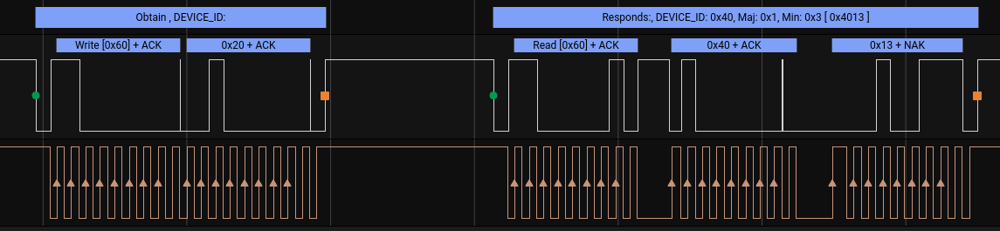

# MCP9600 I2C analyzer
## ===========================================================

This High level Analyzer is displaying information that is exchanged between an MCP9600 and an MCU (like an Arduino) on the I2C.
It will decode (as much as possible) the data that is read/written to a register on the MCP9600. With data that is read from the MCP9600
the register, it will try to decode what is known or else the raw received data is displayed.

Please report problems or additional information / remarks on github

## Prerequisites
Make sure you have a Saleae analyzer and software. This has been tested with a Saleae Logic 8
During my testing I have made use of the [SparkFun Qwiic Thermocouple Amplifier - MCP9600](https://www.sparkfun.com/products/16295). and [Thermocouple Type-K - Stainless Steel](https://www.sparkfun.com/products/13715) I have used their library as well, although there many others on github.

## Software installation
If this analyser can not be selected through the [Saleae interface](https://support.saleae.com/extensions/installing-extensions), or you want to make adjustments perform the following steps:

1. Create a new local extension follow instructions: [https://support.saleae.com/extensions/extensions-quickstart](https://support.saleae.com/extensions/extensions-quickstart)
2. As part of the creation, you want be asked which folder you want to use.
3. Copy / overwrite the 3 files : HighLevelAnalyzer.py, README.md and extension.json from this library in that folder.
4. Restart the Saleae software and you should be able to see this HLA as local extension.

## Getting Started

1. Select and sestup the I2C-signal analyzer from Saleae.
2. Add the MCP9600 Analyzer and select the I2C-signal analyzer as the input

## example
### Device ID

## Versioning

### version 1.0.1 / October 2022
 * Couple of cosmetic changes and erata cleared

### version 1.0.0 / October 2022
 * Initial version

## Author
 * Paul van Haastrecht (paulvha@hotmail.com)

## Acknowledgments
For reference I have included the datasheets in [extras folder](./extras).
